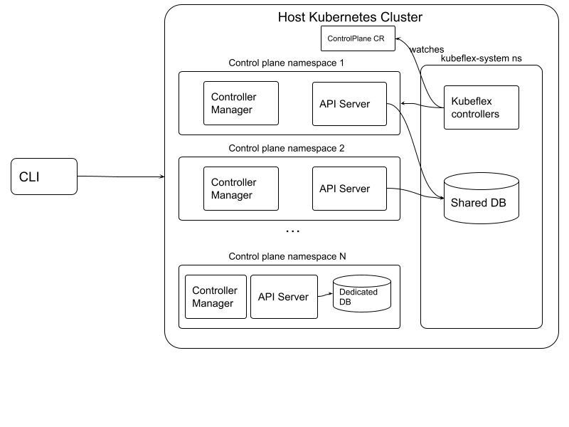

# KubeFlex

A flexible and scalable solution for running Kubernetes control plane APIs.

## Goals

- Provide lightweight Kube API Server instances and selected controllers as a service.
- Provide a flexible architecture for the storage backend, e.g.:
    - shared DB for API servers
    - dedicated DB for each API server
    - etcd DB or Kine + Postgres DB
- Flexibility in choice of API Server build:
    - upstream Kube (e.g. `registry.k8s.io/kube-apiserver:v1.27.1`)    
    - trimmed down API Server builds (e.g. [multicluster control plane](https://github.com/open-cluster-management-io/multicluster-controlplane))
- Single binary CLI for improved user experience:
    - initialize, install operator, manage lifecycle of control planes and contexts

## Architecture



## Prereqs

- go version>=go1.19.2 
- git
- make 
- gcc
- docker
- kind

Make sure that `${HOME}/go/bin` is in your `$PATH`.

## Quickstart
At this time the quickstart has only been tested on macOS (arm64) and CentOS 7 (amd64) .

Clone this repo, build the binaries and add them to your path:

```shell
git clone https://github.com/kubestellar/kubeflex.git
cd kubeflex
make build-all
export PATH=$(pwd)/bin:$PATH
```

Create the hostimg kind cluster with ingress controller and install 
the kubeflex controllers:

```shell
kflex init --create-kind
```

Create a control plane:

```shell 
kflex create cp1
```

Interact with the new control plane, for example get namespaces and create a new one:

```shell
kubectl get ns
kubectl create ns myns
```

Create a second control plane and check that you don't have the namespace created in the
first one:

```shell
kflex create cp2
kubectl get ns
```

To go back to the hosting cluster context, use the `ctx` command:

```shell
kflex ctx
```

To switch back to a control plane context, use the 
`create <control plane name>` command, e.g:

```shell
kflex ctx cp1
```

To delete a control plane, use the `delete <control plane name>` command, e.g:

```shell
kflex delete cp1
```
